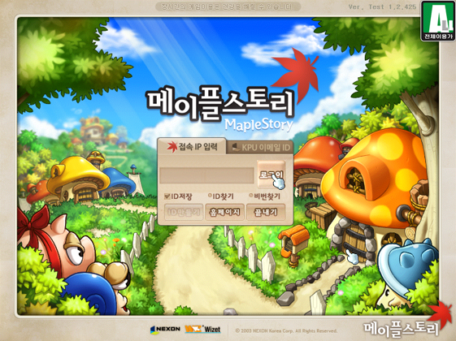
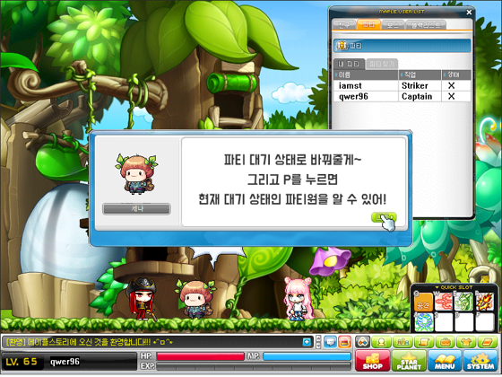
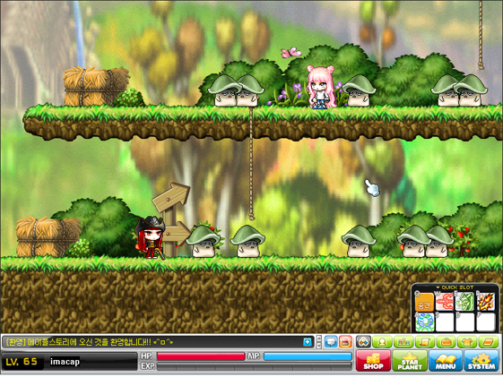
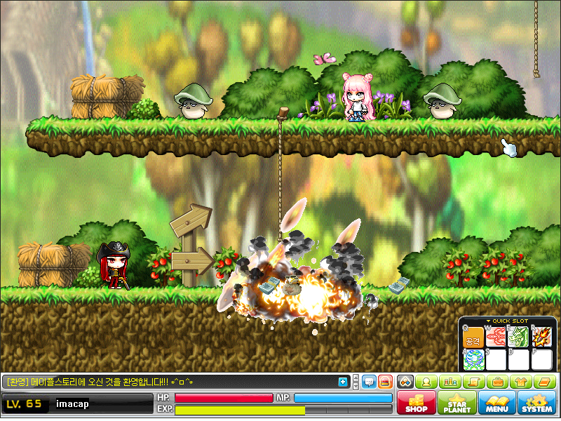
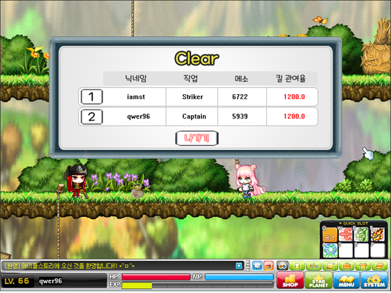

# MapleStory
> 2018-2 '네트워크 게임 프로그래밍' 강의를 들으며 진행한 멀티게임 개발 프로젝트입니다.

2인의 플레이어가 '파티퀘스트'에 참가하여 몬스터를 사냥하는 게임입니다.
'메이플스토리'의 리소스를 사용하여 구현했습니다.
* winAPI
* TCP/IP
* game development

## 게임 플레이
1. Title
* 접속하고자 하는 서버의 IP주소를 입력하면 입장하게 됩니다.

2. Ready
* 플레이어는 자신의 캐릭터를 생성할 수 있습니다.
* 2가지 직업 중 하나를 선택하고 닉네임을 정할 수 있습니다.

3. In Game
* NPC를 통해 파티를 참가할 수 있습니다.
* 'P'키를 누르면 플레이어의 현재 파티 상태를 알 수 있습니다.
* 이때 2명의 플레이어가 모두 파티 참가를 수락하면 자동으로 사냥터로 이동합니다.

* 사냥터에 있는 몬스터를 사냥하면 아이템(메소)과 경험치를 얻을 수 있습니다.

4. Result
* 각 플레이어의 직업과 닉네임, 아이템(메소), 킬 관여율을 확인할 수 있습니다.

## 플레이 영상
[![][youtube-image]][play-url]

<!-- Markdown link & img dfn's -->
[youtube-image]: https://encrypted-tbn0.gstatic.com/images?q=tbn%3AANd9GcQ0W15QOoCkGdmGAT4yoszK-lomT0IYZmOkZ_m_cGhQJEoHyY-Z&usqp=CAU
[play-url]: https://youtu.be/13mPZajDJHM 
